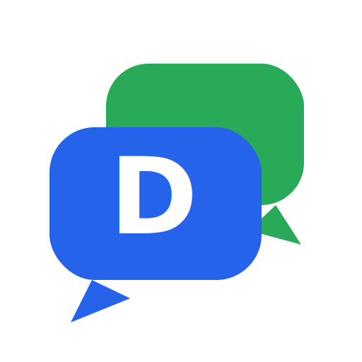

<p align="center">
  
</p>

<h1 align="center">DualMind 🤖</h1>

<p align="center"><b>One chatbot, two minds</b> — a Recruitment Assistant and an Employee Help Desk in a single chat interface.</p>

---

**DualMind** is a dual-mode chatbot for small companies (30–100 employees). It runs fully client-side — no backend, no API keys required, clone and run. Optionally, plug in your own Claude API key to switch from the built-in rule engine to grounded AI answers (see [AI Mode](#-ai-mode-optional-bring-your-own-key)).

## ✨ Features

**🎯 Recruitment Mode**
- Answers candidate FAQs (eligibility, application process, interview steps)
- Simulated resume upload & analysis with skill extraction and match scoring
- Suggests matching roles from a job catalog and walks through a mock application flow

**🛠️ Employee Help Mode**
- IT support, HR, leave, and payroll FAQs
- Quick-action topics for the most common employee questions

**💬 Chat Experience**
- Seamless mode switching in one conversation
- Floating chat widget, typing indicator, quick-action buttons
- Clean, responsive, WhatsApp-style UI

## ⚡ AI Mode (optional, bring your own key)

By default DualMind answers from a **rule-based engine**: stopword removal, light stemming, a synonym map, and scored retrieval over a ~60-entry FAQ knowledge base. That works offline and costs nothing.

With your own Claude API key, it upgrades to a **client-side RAG pipeline**:

1. The retrieval engine pulls the top 5 relevant knowledge-base entries for your question
2. Claude answers **only from those excerpts** (with source citations), so it can't invent policies
3. Any failure — no key, bad key, rate limit, network — silently falls back to the rule engine

To enable it: open the chat → ⚙️ settings → paste your [Claude API key](https://platform.claude.com/) and pick a model. The key is stored **only in your browser's localStorage** and sent **only to the Claude API** — this repo has no backend and no key ever appears in the code or bundle.

```
User question ──▶ FAQ retrieval (top-5) ──▶ Claude API (grounded prompt) ──▶ answer + source
                        │                          │ (no key / any error)
                        └──────────────────────────▶ rule-based engine ──▶ answer
```

## 🧰 Tech Stack

- **React 19** + **TypeScript**
- **Vite 7** for dev/build
- **React Router 7**
- **Anthropic SDK** (`@anthropic-ai/sdk`) for optional AI mode
- Plain CSS with custom utility classes (no UI framework)

## 🚀 Getting Started

```bash
git clone https://github.com/adityarajsingh-git/dualmind-chatbot.git
cd dualmind-chatbot
npm install
npm run dev        # start dev server
npm run build      # production build
```

## 📁 Project Structure

```
src/
├── App.tsx                    # main app: chat UI, modes, modals
├── components/
│   └── LandingBackground.tsx  # landing hero
├── utils/
│   ├── responseEngine.ts      # scored FAQ retrieval + keyword intents (rule-based)
│   ├── llmClient.ts           # optional AI mode: BYO-key Claude client + grounded prompt
│   └── resumeParser.ts        # resume parsing, job matching, analysis output
├── data/mockData.ts           # job catalog + generic FAQ knowledge base
├── types/index.ts             # shared TypeScript types
└── assets/                    # logo & backgrounds
```

## 🗺️ Roadmap

- ~~Wire responses to a real LLM API~~ ✅ done — BYO-key AI mode with grounded RAG
- Real PDF parsing for resumes (pdf.js) instead of simulated extraction
- Persist chat history
- Split `App.tsx` into smaller components
- Editable knowledge base (per-company policies) instead of a static file

## 📝 Notes

All names, emails, phone numbers, and company references in the mock data are fictional. Built as a learning/hackathon concept by [Adityaraj Singh](https://github.com/adityarajsingh-git).

## 📄 License

[MIT](./LICENSE)
